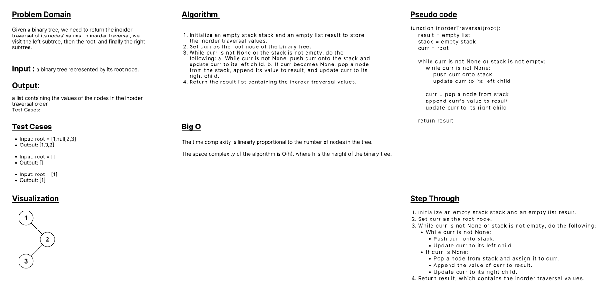
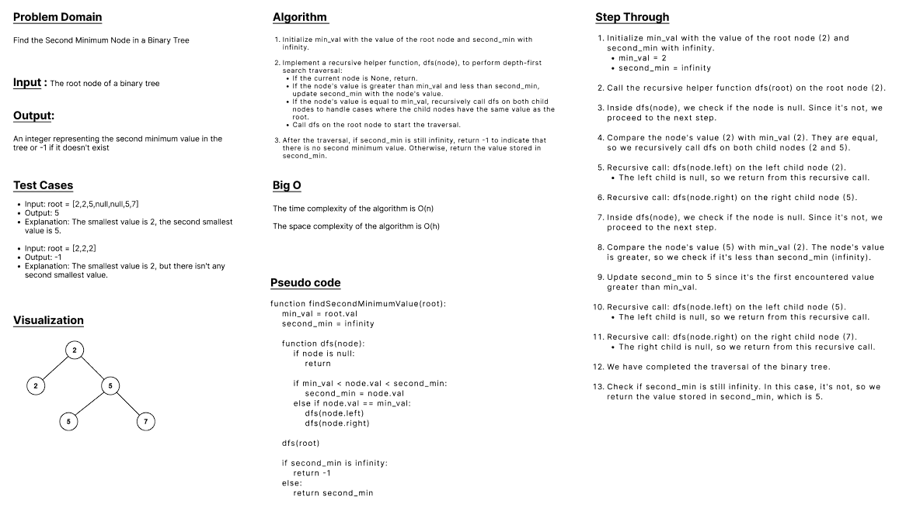

# Computational-Thinking

### Lab-36 
<br>

### Feature Tasks and Requirements
#### View these videos and start practicing.

- [Top 10 Algorithm Techniques for Coding Interview Part 1](https://www.youtube.com/watch?v=r1MXwyiGi_U)
- [Top 10 Algorithm Techniques for Coding Interview Part 2](https://www.youtube.com/watch?v=zHczhZn-z30)
- [5 Things to avoid in Coding Interviews](https://www.youtube.com/watch?v=FowJZqVggCU)

<br>

### Submission Notes
- Submission is image of white board for 2 (or more) code challenges of your choosing.

    - The challenges should relate to the Top 10 list in videos.
    - In other words, select challenges that best align with your Coding Interview needs.
    - Choose from LeetCode, Exercism, HackerRank, etc.

<br>


- No code files accepted. All work should be done within whiteboard.

- Your white board tool is up to you.

<br>

---

<br>

### Q1: Binary Tree Inorder Traversal
**[Link](https://leetcode.com/problems/binary-tree-inorder-traversal/submissions/)**

<br>

#### Given the root of a binary tree, return the inorder traversal of its nodes' values.
<br>

```
# Definition for a binary tree node.
# class TreeNode(object):
#     def __init__(self, val=0, left=None, right=None):
#         self.val = val
#         self.left = left
#         self.right = right
```

<br>

- Example 1:
```
Input: root = [1,null,2,3]
Output: [1,3,2]
```
<br>

- Example 2:
```
Input: root = []
Output: []
```
<br>

- Example 3:
```
Input: root = [1]
Output: [1]
```

<br>

### Constraints:
#### The number of nodes in the tree is in the range [0, 100].
#### -100 <= Node.val <= 100

<br>

### Whiteboard



<br>

---
<br>

### Q2: Second Minimum Node In a Binary Tree

**[Link](https://leetcode.com/problems/second-minimum-node-in-a-binary-tree/submissions/)**

<br>

#### Given a non-empty special binary tree consisting of nodes with the non-negative value, where each node in this tree has exactly two or zero sub-node. If the node has two sub-nodes, then this node's value is the smaller value among its two sub-nodes. More formally, the property root.val = min(root.left.val, root.right.val) always holds.

#### Given such a binary tree, you need to output the second minimum value in the set made of all the nodes' value in the whole tree.

#### If no such second minimum value exists, output -1 instead.

<br>

```
# Definition for a binary tree node.
# class TreeNode(object):
#     def __init__(self, val=0, left=None, right=None):
#         self.val = val
#         self.left = left
#         self.right = right
```
<br>

- Example 1:
```
Input: root = [2,2,5,null,null,5,7]
Output: 5
Explanation: The smallest value is 2, the second smallest value is 5.
```
<br>

- Example 2:
```
Input: root = [2,2,2]
Output: -1
Explanation: The smallest value is 2, but there isn't any second smallest value.
```

<br>

### Constraints:

#### The number of nodes in the tree is in the range [1, 25].
#### 1 <= Node.val <= 231 - 1
#### root.val == min(root.left.val, root.right.val) for each internal node of the tree.

<br>

### Whiteboard



<br>

---
<br>